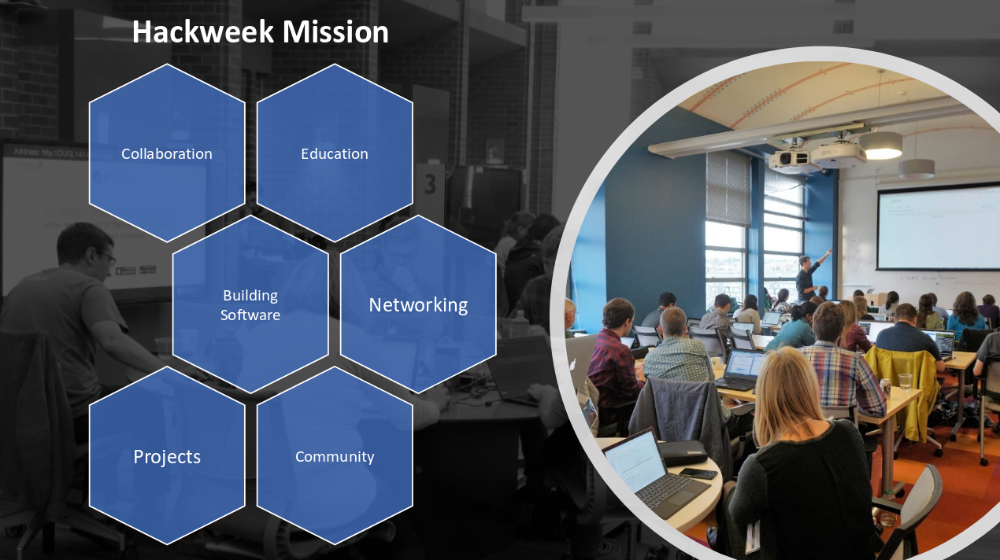

# Introduction to A Climate Change Position Statement Consensus Building Experiment 

## SOCIETY MUST ADDRESS THE GROWING CLIMATE CRISIS NOW

Prompt and concerted actions to limit and adapt to human-caused climate change are less costly than remaining on the current trajectory and can provide great benefits for human well-being.
 
## The Challenge
Human activities are changing Earth’s climate, causing increasingly disruptive impacts to society and the environment.  To limit these impacts, the world’s nations agreed to hold the increase in global average temperature, relative to pre-industrial levels, to well below 2°C (3.6°F). To have a good chance of achieving this goal, human society must promptly reduce its greenhouse gas emissions, including bringing net carbon dioxide emissions to zero. Such reductions require substantial near-term transformations in energy sources and consumption, more efficient food systems, and enhanced removal of carbon dioxide (CO2) from the atmosphere. At the same time, societies must prepare to cope with and adapt to the adverse impacts of climate change. Done strategically, efficiently and equitably, the needed transformations can provide increased health, well-being, and prosperity for society.                
 
## The Evidence
 
Concentrations of greenhouse gases—including CO2, methane, nitrous oxide, and halocarbons—in the atmosphere rose to unprecedented levels in at least the last 800,000 years due to fossil-fuel burning and other human activities. Extensive, scientific observations document that the global average surface temperature in the atmosphere and ocean has increased by about 1°C (1.8°F) since the late 1800s. It is extremely likely that human influences are responsible for most, and possibly all, of the observed global warming since the mid-20th century. 
 
In addition to increasing average temperatures, many other striking changes have been documented. These include more frequent heat waves on land and in the ocean; reductions in Arctic sea ice, Northern hemisphere snow cover, Greenland and West Antarctic ice sheets, and mountain glaciers; changes in the global water cycle that escalate precipitation; and a rise in global sea-level. Increased CO2 concentrations in the atmosphere are also directly acidifying ocean waters and affecting the growth and nutritional value of land plants. 
          
## The Predictions
 
Realistic and continually improving computer simulations of the global climate predict that both temperature and sea level will continue to rise as a result of past and future greenhouse gas emissions. Past emissions will contribute to some additional heating into the near-future. However, the amount of rise will be predominantly determined by future human-caused emissions. Global average temperature will only stabilize after net emissions of CO2 reach zero, i.e. the amount entering the atmosphere is matched by the amount removed, and emissions of other greenhouse gases are stable or decreasing. Simulations demonstrate that limiting the temperature increase to 1.5°C, including the 1.0°C warming that has already occurred, requires that human-caused CO2 net emissions reach zero by or shortly after 2050. Large reductions in emissions of other greenhouse gases are also required, as well as active removal of CO2 from the atmosphere during subsequent decades. Even if global temperature is stabilized, sea level will continue to rise, but at a much slower rate than if warming continued.
 
## The Consequences
 
Climate change has been and will continue to be disruptive because ecosystems and human communities were established under previous climatic conditions. Climate change and associated uncertainties will cause increasing health, economic, security, and ecological risks. Preserving the habitability of the planet for humans, flora, and fauna is paramount. Further, the impacts of climate change on human health and well-being include heat-related death, illness, and loss of labor productivity; increased exposures to allergens, vector-borne and infectious diseases, and algal toxins; changing patterns and increasingly severe hazards such as landslides, flooding and wildfires, and water scarcity; uncertainty in aquatic and traditional food systems, and decreased mental health. The increasing frequency and severity of extreme events can also slow economic growth and increase civil conflict, thus affecting global migration patterns and increasing global security risks.
Climate change presents new challenges, and is also a threat multiplier. Impacts will vary based not only on geography and availability and quality of infrastructure (e.g. the disruption of normal healthcare delivery during a storm), but also by race, age, and socioeconomic status. People of color, children, the elderly, and low income communities are some of the most vulnerable to climate change. Climate change will amplify pre-existing inequalities in all populations with less capacity to adapt to change. It will continue to severely damage threatened ecosystems, such as coral reefs, permafrost landscapes and the Arctic, and cause loss of biodiversity on land and in the oceans. It can increase the risks and negative effects of wildfires and extreme weather events and affect the spread of invasive species, pests and diseases. 
 
## The Needed Responses
 
Effective climate policies will rely on innovative and responsive science to inform and weigh response options. Scientists and engineers must continue to engage broadly with youth, community, business and non-profit leaders; local, state, and tribal government resource managers and planners; and federal policy makers, to undertake solution-oriented research and analysis. Scientific organizations, including academic institutions and government agencies, should expand their support for research, application, and information dissemination that addresses the climate crisis.
Deleterious consequences of global climate change can be moderated by taking prompt actions. We have included broader political and societal recommendations, as well as recommendations specifically targeted for the geophysical scientific community:
Political and Societal Recommendations:
•	transition to renewable sources of energy,
•	reduce demand for high greenhouse gas emitting products and services,
•	implement existing and novel technologies and practices to remove CO2 from the atmosphere,
•	change diets and promote sustainable food systems,
•	improve access to family planning and women's education,
•	promote collective action/mobilization in engaging with policymakers,
•	promote active transport and smart design of cities, 
•	develop processes that enhance and diversify decision making based on direct input from the geoscience community, including scientifically accurate technical explanations of Earth processes and climate change impacts to humanity,
•	support innovative geoscience communication and education efforts which improve individual data reasoning in a digital world,
•	prepare for changes already underway.
 
## Scientific Community Recommendations:
•	measure and model the feedback of moderating actions (listed above) using current observations and climate predictions, 
•	expand diverse, inclusive and culturally relevant geoscience education that enables growth of a global digitally-enabled geoscience research, education and information management workforce, which can be used to
•	develop innovative education initiatives which address the broader impacts of the physical and mental health risks to individuals when presented with geoscience and data reasoning related to future uncertainties, 
•	translate and deliver high-impact, accessible, geoscience research products to the public, education and scientific research communities that enable individual action and participation in moderating actions (listed above). 
•	in order to advance our understanding of changes already underway.
 
Climate intervention approaches, such as carbon dioxide removal and albedo modification, cannot substitute for deep cuts in emissions or the need for adaptation, but might contribute to a comprehensive climate risk-management strategy.  These actions must involve integration of knowledge, risks, and solutions with scales of impact across local, regional, national, and global communities. With creativity and innovation, our actions to address global climate change can also yield significant economic, environmental, health, and social benefits. As we improve best practices in public education, citizen and participatory science, the negative mental health impacts of an uncertain future should be moderated by geoscience understanding that enables society to determine a healthy future.  Positive impacts of our actions could include new employment opportunities in clean energy and digital infrastructure, opportunities to enhance political diplomacy and maintain collaborative agreements, risk-informed economic stability, natural hazard preparedness, life-saving planning and communication systems, protection of endangered species and threatened ecosystems, equitable access to public global geoscience information resources, and improved public health for all of Earth’s geographically diverse communities.

Welcome to the [{{ hackweek.name }}]({{ hackweek.web_url }}) hackweek! Hackweeks were originally designed by the University of Washington's [eScience Institute](https://escience.washington.edu/), and they aim to provide a welcoming learning environment where you can learn new software tools, collaborate with colleagues, build community and make progress on specific projects. Our [hackweek model](https://www.pnas.org/content/115/36/8872) is constantly evolving and we invite you actively participate as we experiment with new approaches and ideas.

This preliminary tutorial is one that we would like you to complete before arriving to the hackweek. The purpose is to learn about how we plan to work with various software tools and how you can best prepare for our event. We would like everyone works through this tutorial so that we can make the best use of our time together in person. 

### What is the format of this event?

Here is a general roadmap of our event:

* we begin the hackweek with a review of our code of conduct, and we build a set of guidelines for co-creating a positive and welcoming learning environment
* each day will include some combination of tutorials, short presentations and/or open project time / hacking.
* we will guide participants through the formation of groups early in the event
*we'll check-in with project teams on a regular basis to find what's working and where challenges lie.
* there will be opportunities for peer learning and open tutorials on topics of most interest to the group
* participants will be invited to present their work at the end of the event

### Will my laptop work for this hackathon?

All participants will be required to have their own laptop. The absolute minimum requirement is any laptop with a functioning web browser so that you can access our shared cloud computing resources. We will also teach you to install software on your own computer. For that we recommend the following:

- Windows Vista or newer, MAC OS X 10.7+, or Linux (Ubuntu, RedHat and others; CentOS 5+)
- 32-bit or 64-bit
- Minimum 3 GB disk space to download and install software

If you do not have a laptop, please contact us and we might be able to loan you one during the event.

### Will I need to learn a specific programming language to participate?

We welcome all participants regardless of their programming background. In order to teach our content in a consistent way we need to select one programming languge. We have chosen Python because it is free and open source, and has many libraries suitable for efficient manipulation of a variety of different types of data. 

### What can I do in advance to prepare?

We require all participants to work through the following lessons in advance of our event. The lessons are brief and will ensure that we are all set up and ready to work when we arrive.

#### Setting up your laptop and getting access to computing resources

* [Lesson 1](github.md): setting up a GitHub account
* [Lesson 2](jupyterhub.md): connecting to our shared cloud computing environment
* [Lesson 3](conda.md): installing Python on your laptop
* [Lesson 4](earthdata.md): getting a NASA Earthdata login

#### Learning Python Basics

* [Lesson 5](numpy.md): introduction to Numpy
* [Lesson 6](pandas.md): introduction to Pandas

### How do I ask questions about the Hackweek?
If you have technical or general questions about the Hackweek, we are here to help. First, you can use the General channel on [Slack]({{ hackweek.slack_url }}). Second, we will offer a schedule of online "office hours" for you to get help as you work through the tutorials above.

#### Online Office Hours Schedule

Here is the [zoom link]() for all of the office hour sessions.

| Date | Time | Lesson Topic | 
| :--- | :----  | :----: |
| January x, 2020 | 2:00 PM Pacific Time | Lessons 1 and 2 |

(provide links to code of conduct and norms of behavior as they apply to these calls as well)

